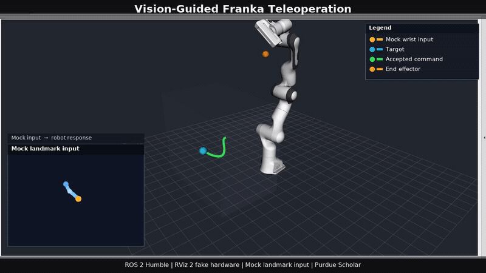

# Vision-Guided Franka Panda Teleoperation

[](https://wiki.ros.org/noetic)
[](requirements.txt)
[](https://github.com/raayraay96/summer25-Franka-ros-noetic/actions/workflows/ci.yml)
[](LICENSE)

**Single-webcam EE position teleop for Franka Panda with shoulder-relative mapping, workspace safety, and dry-run default.**

<p align="center">
  
</p>

Developed initially during the **HUMANS MOVE Program at the University of Wyoming**. After the program concluded, Eric Raymond independently refactored the research prototype into a modular, testable, safety-gated portfolio system. The verified hero demo uses mock landmarks and RViz 2 fake hardware on Purdue Scholar; it is not physical-robot proof.

## Contents

- [60-Second Run (No Robot)](#60-second-run-no-robot)
- [Demo](#demo)
- [Architecture and Technical Design](#architecture)
- [Results](#results)
- [Limitations](#limitations)
- [Roadmap, Contribution, and Citation](#roadmap)

## 60-Second Run (No Robot)

```bash
git clone https://github.com/raayraay96/summer25-Franka-ros-noetic.git && cd summer25-Franka-ros-noetic
```

```bash
docker build -f Dockerfile.noetic -t franka-teleop:noetic .
```

```bash
docker run --rm franka-teleop:noetic bash scripts/ci_smoke_noetic.sh
```

The third command runs pure-logic tests, confirms the catkin package, and smoke-tests `simulation.launch` with mock landmarks and no robot. Native developer checks also work without ROS:

```bash
python3 -m pip install -r requirements.txt
python3 -m pytest -q tests/
```

ROS Noetic launch paths inside the container or a configured Noetic workspace:

```bash
roslaunch vision_arm_control simulation.launch
roslaunch vision_arm_control mimicry.launch use_mock_landmarks:=true use_robot:=false
roslaunch vision_arm_control perception_only.launch headless:=true
```

Model weights stay outside Git. See [`docs/model-setup.md`](docs/model-setup.md) for `FRANKA_MODEL_DIR` and Purdue Scholar setup.

## Demo

| Asset | Label | Status |
|---|---|---|
| [GIF](docs/media/franka-rviz-dry-run.gif) · [MP4](docs/media/franka-rviz-dry-run.mp4) | Mock wrist input → mapped target → safety gate → RViz 2 Panda | **Verified** Scholar fake-hardware run; no Franka connected |
| [GIF](docs/media/safety-workspace-violation.gif) · [MP4](docs/media/safety-workspace-violation.mp4) | Workspace violation → command rejected | Generated from the repository safety utility; synthetic input, no ROS/hardware |
| [GIF](docs/media/perception-headless-relative-depth.gif) · [MP4](docs/media/perception-headless-relative-depth.mp4) | Headless landmark JSON + relative-depth visualization | Synthetic schema demonstration; not a camera or hardware benchmark |
| [Screenshot 1](https://github.com/user-attachments/assets/b5c32aea-6236-45f5-b62f-182bf95e7df9) · [Screenshot 2](https://github.com/user-attachments/assets/ddf8d767-7f2e-402e-ac0e-d0cc13ebf851) | Research-period depth output | Perception-only, not hardware proof |
| Planned | Gazebo + MoveIt collision-aware recording | Not yet validated; the dry-run RViz video above is the current proof |

Demo provenance, labels, and reproduction commands: [`docs/media/README.md`](docs/media/README.md). ROS 2 Scholar evidence: [`docs/ros2-simulation.md`](docs/ros2-simulation.md) and [`results/ros2/`](results/ros2/).

## Key Features

- Modular nodes for camera, pose, depth, mapping, safety, controller, and mock input
- Timestamped JSON MediaPipe landmarks instead of opaque in-process state
- Shoulder-relative end-effector position mapping with explicit normalized → pixel → camera → base stages
- Workspace rejection/clamping, velocity limiting, pose timeout, stale-command checks, E-stop, and dead-man hooks
- `dry_run` and `use_robot:=false` defaults across configuration and launch files
- MonoDepth2-style `1 / disparity` visualization labeled as **relative**, never metric
- YAML configuration for camera, mapping, models, safety, and controller behavior
- Pure-Python tests that run without ROS plus ROS Noetic container and ROS 2 Scholar simulation paths
- Reproducible CPU benchmarks with committed evidence and unmeasured physical metrics left unclaimed
- Model weights, rosbag files, build outputs, and local paths excluded from Git

## Architecture

```text
webcam / rosbag / mock landmarks
              │
              ▼
      pose_estimator_node ───────────────┐
              │ timestamped JSON         │ optional
              ▼                          ▼
 human_to_robot_mapper_node      depth_estimator_node
 shoulder-relative EE target      relative depth only
              │
              ▼
      safety_monitor_node
 workspace · velocity · timeout · E-stop · dead-man
              │ accepted command
              ▼
     robot_controller_node
       dry_run by default
```

Visual references: [architecture](docs/architecture.svg) · [topic graph](docs/topic-graph.svg) · [frame tree](docs/frame-tree.svg) · [ROS 2 simulation](docs/ros2-architecture.svg).

## Technical Design

| Node | Role |
|---|---|
| `camera_node` | Publishes webcam frames as compressed images |
| `pose_estimator_node` | Runs MediaPipe and publishes timestamped landmark JSON |
| `depth_estimator_node` | Produces optional MonoDepth2-style relative depth visualization |
| `human_to_robot_mapper_node` | Maps shoulder-relative wrist motion to an EE position target |
| `safety_monitor_node` | Rejects unsafe, stale, or disabled commands before control |
| `robot_controller_node` | Logs dry-run targets or crosses an explicit simulation/robot boundary |
| `mock_landmark_publisher` | Supplies deterministic synthetic landmarks for CI and demos |

The design is **end-effector position teleoperation**, not full pose or joint mimicry. Calibration status and frame assumptions are explicit in [`docs/calibration.md`](docs/calibration.md); real-robot requirements are explicit in [`docs/safety.md`](docs/safety.md).

## Results

Only reproduced measurements are listed. CPU values measure code stages, not camera inference, network transport, or physical Franka motion.

| Metric | Result | Environment | Evidence |
|---|---:|---|---|
| Mapping stage latency | **0.0049 ms mean; 0.0080 ms p95; n=5,000** | x86_64 audit host, Python 3.13.13, no ROS | [`results/mapping_benchmark.json`](results/mapping_benchmark.json) |
| Map + filter + workspace latency | **0.0298 ms mean; 0% rejects; n=2,000** | x86_64 audit host, Python 3.13.13, no ROS | [`results/latency_benchmark.json`](results/latency_benchmark.json) |
| ROS 2 target / command / joint / safety rate | **~20 Hz** | Purdue Scholar, RViz 2 fake hardware | [`results/ros2/topic-rates.json`](results/ros2/topic-rates.json) |
| ROS 2 joint path travel | **6.33 rad over 12 s** | Mock trajectory, geometric IK approximation | [`results/ros2/run-summary.json`](results/ros2/run-summary.json) |
| Max single-joint excursion | **1.02 rad** | Recorded Scholar demo window | [`results/ros2/recording-metrics.json`](results/ros2/recording-metrics.json) |
| Physical Franka tracking error | **Not yet measured** | Calibrated camera + lab robot required | — |
| End-to-end physical latency | **Not yet measured** | Camera + network + controller + robot required | — |

Reproduce the CPU measurements:

```bash
python benchmarks/benchmark_mapping.py
python benchmarks/benchmark_latency.py
```

## Challenges & Engineering Decisions

The preserved audit in [`docs/repository-audit.md`](docs/repository-audit.md) records the prototype issues and the portfolio fixes:

1. **Normalized image coordinates were treated as `base_link` targets.** Added an explicit frame pipeline and shoulder-relative mode instead of presenting image-space values as robot coordinates.
2. **Depth was computed but not fused into control.** Kept it visualization-only and documented `relative_depth = 1 / disparity` as non-metric.
3. **The incomplete `ikpy` chain was unsafe as a primary controller.** Replaced it with a dry-run boundary and a separately labeled geometric-IK simulation path.
4. **Model weights and bags polluted the repository history.** Rebuilt the public branches from a clean root, externalized models, and added CI history guards.
5. **Hardcoded machine paths prevented reproduction.** Replaced them with ROS parameters, container paths, and `FRANKA_MODEL_DIR`.

## Limitations

- Relative monocular depth is not metric distance and is not used as a validated robot range measurement.
- Camera intrinsics and camera-to-base transforms remain `status: example` until measured calibration is recorded.
- ROS Noetic and Ubuntu 20.04 are end-of-life foundations; the ROS 2 path is a simulation proof, not full hardware parity.
- Gazebo + MoveIt collision-aware execution has not been validated on the audit host.
- No physical Franka was available for CI or re-validation of this portfolio branch.
- Geometric IK in the Scholar demo is an approximation, not an industrial Franka controller.
- Software bounds, timeouts, and E-stop topics are not a safety certification or a substitute for Franka Desk, a physical E-stop, a dead-man control, and lab procedures.

## Roadmap

| State | Work |
|---|---|
| **Implemented** | Modular ROS1 nodes, pure-logic tests, pinned environment, Noetic container, CI, safety gates, clean history, ROS 2 RViz demo |
| **In progress** | Measured camera calibration, dedicated safety/perception recordings from ROS topics, MoveIt planning integration |
| **Planned** | RGB-D metric mapping, Gazebo collision demo, physical Franka re-validation with tracking and latency measurements |

## Author Contribution

| Work | Contribution |
|---|---|
| HUMANS MOVE research prototype, Summer 2024 | Eric Raymond: perception experiments, ROS integration, teleoperation prototype, and research artifacts completed during the program |
| Independent post-program portfolio engineering, 2026 | Eric Raymond: modular architecture, mapping/safety refactor, tests, benchmarks, documentation, CI, containers, and Purdue Scholar simulation workflow |
| Third-party systems | MediaPipe by Google; MonoDepth2 by Niantic; ROS/MoveIt and Franka ecosystem packages by their maintainers |

## Citation

This repository was developed from work completed in the **HUMANS MOVE Program, University of Wyoming**. Cite the project with [`CITATION.cff`](CITATION.cff), and cite [MonoDepth2](https://github.com/nianticlabs/monodepth2), [MediaPipe](https://github.com/google/mediapipe), [ROS](https://www.ros.org/), [MoveIt](https://moveit.ros.org/), and [Franka Robotics](https://franka.de/) when their components are used.

## License

Code authored for this repository is released under the [MIT License](LICENSE). Third-party models, datasets, packages, and pretrained weights retain their own licenses and are not redistributed here.
