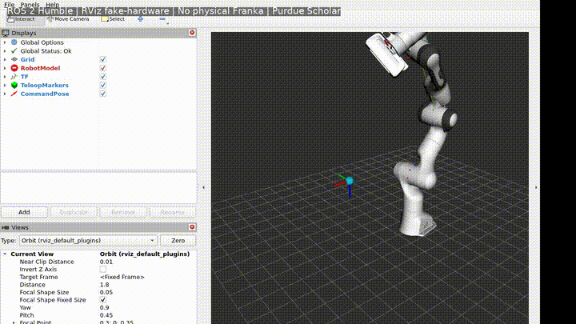
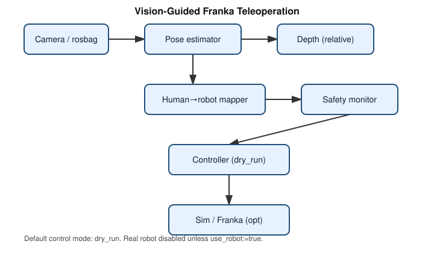

# Vision-Guided Franka Panda Teleoperation

**End-effector position teleoperation** for a Franka Emika Panda using ROS Noetic, MediaPipe human pose estimation, optional monocular depth visualization, workspace safety filters, and a dry-run / simulation-first controller interface.

Developed during the **HUMANS MOVE Program** at the University of Wyoming; portfolio engineering refresh on branch `portfolio-v2`.

> **What this is not (yet):** metric depth SLAM, full upper-body joint mimicry, certified safety software, or a claim of validated physical Franka tracking accuracy. See [Limitations](#12-limitations).

---

## ROS 2 Simulation Demo



[Full MP4 demonstration](docs/demo/ros2-franka-teleoperation.mp4)

**Demo type:** ROS 2 MoveIt-capable stack / **RViz 2 fake-hardware simulation** on Purdue Scholar  
**Hardware:** No physical Franka connected  
**Input:** Smooth mock human-landmark trajectory  
**Controller:** Geometric IK → `/joint_states` + `robot_state_publisher` (not Gazebo; not physical hardware)  
**Depth:** Visualization-only — not used for control (shoulder-relative EE teleop)

Reproduction and evidence: [`docs/ros2-simulation.md`](docs/ros2-simulation.md) · [`scholar/ROS2_SIMULATION.md`](scholar/ROS2_SIMULATION.md) · [`results/ros2/`](results/ros2/)

### Verified pipeline metrics (Scholar job 459315)

| Check | Result |
|-------|--------|
| `colcon build` | 2 packages OK |
| Target / command pose rate | ~20 Hz |
| Joint states rate | ~19.7 Hz |
| Joint travel during demo window | ~0.92 rad (moved) |
| Physical hardware | **false** |

## 1. Additional demos / research artifacts

| Asset | Label | Status |
|-------|--------|--------|
| ROS 2 simulation GIF/MP4 | RViz 2 fake-hardware simulation | [`docs/demo/`](docs/demo/) |
| Depth map screenshots (research period) | Perception-only demonstration | Historical GitHub assets |
| Architecture diagram | Design documentation | [`docs/architecture.svg`](docs/architecture.svg) · [`docs/ros2-architecture.svg`](docs/ros2-architecture.svg) |
| Physical Franka video | Real hardware | **Not yet published** |
| Gazebo full-stack recording | Gazebo simulation | **Not the verified Scholar demo path** |

Historical depth visualizations from the research period (perception-only, not hardware proof):


---

## 2. Key features (implemented in `portfolio-v2`)

- Modular ROS node layout: pose → mapping → safety → controller
- MediaPipe pose landmarks as timestamped JSON messages
- **Shoulder-relative end-effector position mapping** (configurable)
- Explicit frame pipeline utilities (normalized → pixel → camera → base)
- Workspace bounds, velocity limiting, pose-loss timeout, e-stop / dead-man hooks
- Default **`dry_run`** control; real robot requires `use_robot:=true`
- Optional MonoDepth2-style **relative** depth node (not metric)
- YAML configuration under `src/vision_arm_control/config/`
- Unit tests for mapping, safety, filters, and launch/config validation
- Benchmark scripts with honest “not yet measured” gaps
- Purdue Scholar SLURM templates for GPU / batch work
- Models and large artifacts kept **out of Git**

---

## 3. Architecture



Logical topics: [`docs/topic-graph.svg`](docs/topic-graph.svg) · Frames: [`docs/frame-tree.svg`](docs/frame-tree.svg)

```text
Camera / rosbag / mock landmarks
        │
        ▼
pose_estimator_node ──► human_to_robot_mapper_node
        │                         │
        │                         ▼
depth_estimator_node        safety_monitor_node
  (relative depth)                │
                                  ▼
                        robot_controller_node
                          dry_run | sim | real*
```

\* Real mode disabled by default.

Verified repository audit: [`docs/repository-audit.md`](docs/repository-audit.md)

---

## 4. Quick start

### Prerequisites

- Ubuntu 20.04 + ROS Noetic (for full ROS stack)
- Python 3.8–3.10 recommended
- Optional: CUDA PyTorch for MonoDepth2, Franka packages for hardware/sim

### Clone and Python deps

```bash
git clone https://github.com/raayraay96/summer25-Franka-ros-noetic.git
cd summer25-Franka-ros-noetic
git checkout portfolio-v2

python3 -m pip install -r requirements.txt
# pure logic tests (no ROS required):
python3 -m pytest -q tests/
```

### Models (not in Git)

```bash
export FRANKA_MODEL_DIR=/path/to/models
bash scripts/download_models.sh "$FRANKA_MODEL_DIR"
# On Purdue Scholar:
# export FRANKA_MODEL_DIR=$RCAC_SCRATCH/franka-teleop-data/models
```

Details: [`docs/model-setup.md`](docs/model-setup.md)

### Catkin workspace (ROS machine)

```bash
export CATKIN_WS=~/catkin_ws
bash scripts/setup_workspace.sh
source $CATKIN_WS/devel/setup.bash
bash scripts/check_environment.sh
```

---

## 5. Simulation / mock (no Franka)

```bash
# Mock landmarks → mapping → safety → dry controller
roslaunch vision_arm_control simulation.launch

# Or full mimicry pipeline with mock landmarks
roslaunch vision_arm_control mimicry.launch use_mock_landmarks:=true use_robot:=false
```

Optional Gazebo / MoveIt (if installed):

```bash
roslaunch vision_arm_control simulation.launch use_gazebo:=true use_moveit:=true
```

---

## 6. Perception only

```bash
roslaunch vision_arm_control perception_only.launch headless:=true
```

Rosbag replay:

```bash
roslaunch vision_arm_control rosbag_replay.launch bag:=/path/to/recording.bag
```

---

## 7. Real robot

**Default is off.** Software limits are not a substitute for Franka Desk safety, E-stop, or lab procedures. Read [`docs/safety.md`](docs/safety.md).

```bash
# Only when intentionally authorized:
roslaunch vision_arm_control mimicry.launch use_robot:=true control_mode:=real_robot
# Then enable dead-man:  rostopic pub ... safety_monitor_node/deadman ...
```

---

## 8. Technical design

| Node | Role |
|------|------|
| `camera_node` | Webcam → compressed image |
| `pose_estimator_node` | MediaPipe landmarks JSON |
| `depth_estimator_node` | Relative monocular depth |
| `human_to_robot_mapper_node` | EE position teleoperation target |
| `safety_monitor_node` | Workspace / timeout / e-stop gate |
| `robot_controller_node` | dry_run / MoveIt if available |
| `mock_landmark_publisher` | Synthetic landmarks for demos/CI |

**Mapping class:** end-effector **position** teleoperation (shoulder-relative by default), not full pose mimicry or joint-space retargeting.

**Depth:** MonoDepth2-style `1/disparity` is **relative**, not metric meters ([`docs/calibration.md`](docs/calibration.md)).

Legacy monolithic scripts preserved under `src/vision_arm_control/scripts/legacy/`.

---

## 9. Results

Benchmark tooling is included. Metrics below are only those reproduced in this environment.

| Metric | Result | Environment | Evidence |
|--------|--------|-------------|----------|
| Mapping stage latency | *run locally* | CPU, no ROS | `python benchmarks/benchmark_mapping.py` → `results/mapping_benchmark.json` |
| CPU pipeline stage latency | *run locally* | CPU | `python benchmarks/benchmark_latency.py` |
| MediaPipe synthetic frames | optional | needs mediapipe | `python benchmarks/benchmark_perception.py` |
| Physical Franka tracking error | **Not yet measured** | Franka + calibrated camera | — |
| End-to-end real-robot latency | **Not yet measured** | Lab hardware | — |

```bash
python benchmarks/benchmark_mapping.py
python benchmarks/benchmark_latency.py
```

---

## 10. Challenges and engineering decisions

Based on repository evidence ([`docs/repository-audit.md`](docs/repository-audit.md)):

1. **Normalized MediaPipe coordinates were used as `base_link` targets** in the research prototype — corrected conceptually via an explicit mapping pipeline and shoulder-relative mode.
2. **Depth was computed but not fused into targets** — depth remains visualization-first; docs state relative-depth limits.
3. **Incomplete ikpy chain** was unsafe as a primary controller — replaced by dry_run controller + optional MoveIt boundary.
4. **Weights in Git (~120 MB pack)** blocked a clean portfolio repo — weights moved to external storage + download docs.
5. **Hardcoded personal absolute paths** prevented reproduction — replaced with ROS params and `FRANKA_MODEL_DIR`.

---

## 11. Limitations

- Relative monocular depth ≠ metric range
- Example camera intrinsics/extrinsics until calibrated (`status: example`)
- ROS Noetic / Ubuntu 20.04 is EOL-ish for new products; no ROS 2 migration in this branch
- Full Gazebo+MoveIt stack not validated on the audit host (no ROS install)
- Physical Franka execution not re-validated in `portfolio-v2` CI
- Software safety ≠ manufacturer safety certification

---

## 12. Roadmap

| State | Item |
|-------|------|
| **Implemented** | Modular nodes, safety config, tests, Scholar templates, model hygiene, dry_run default |
| **In progress** | Measured calibration, real demo media, Scholar GPU depth benchmarks |
| **Planned** | RGB-D metric mapping, MoveIt collision demos, recorded sim video, history purge of weights on authorized migration |

---

## 13. Author contribution

| Work | Credit |
|------|--------|
| HUMANS MOVE research prototype, perception experiments, depth screenshots | Eric Raymond |
| Portfolio refactor (`portfolio-v2`): architecture, safety, tests, docs, Scholar workflow | Eric Raymond |
| MediaPipe | Google (Apache-2.0) |
| MonoDepth2 | Niantic — cite and follow research license |
| ROS / MoveIt / Franka packages | Open Robotics / Franka Robotics / community |

---

## 14. Citation and acknowledgments

- HUMANS MOVE Program, University of Wyoming  
- [MonoDepth2](https://github.com/nianticlabs/monodepth2)  
- [MediaPipe](https://github.com/google/mediapipe)  
- [ROS](https://www.ros.org/) · [MoveIt](https://moveit.ros.org/) · [Franka Robotics](https://www.franka.de/)

```bibtex
@misc{raymond_franka_teleop,
  author = {Raymond, Eric},
  title  = {Vision-Guided Franka Panda Teleoperation},
  year   = {2025},
  note   = {HUMANS MOVE Program, University of Wyoming; portfolio branch portfolio-v2},
  url    = {https://github.com/raayraay96/summer25-Franka-ros-noetic}
}
```

## License

MIT — see [`LICENSE`](LICENSE). Third-party models and submodules retain their own licenses.
