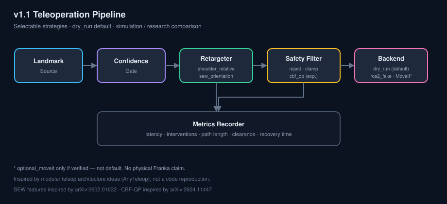

# Case Study: Research-Informed Retargeting & Safety (v1.1)

**Reading time:** ~4 minutes  
**Author:** Eric Raymond · Independent post-program portfolio engineering (2026)  
**Prototype origin:** HUMANS MOVE Program, University of Wyoming (Summer 2024) — not a supervisor of this work

---

## 1. Problem

Vision-guided Franka teleoperation needs a clear path from a research prototype to a **reproducible, comparable** system: baseline EE mapping vs orientation-aware retargeting, and hard safety gates vs an experimental CBF filter — without claiming paper-level or hardware-level guarantees that were never measured.

## 2. Research reviewed

| Paper | Inspired idea |
|-------|----------------|
| SEW-Mimic (arXiv:2602.01632) | Shoulder–elbow–wrist orientation features |
| CBF imitation safety (arXiv:2604.11447) | CBF-QP command filter |
| AnyTeleop (arXiv:2307.04577) | Modular strategy interfaces |
| Shared-control quadruped arm (arXiv:2508.14994) | Vision wrist teleop + safety gating |

Details: [`docs/research/related-work.md`](research/related-work.md)

## 3. Baseline system

v1.0 portfolio stack: MediaPipe-style landmarks → **shoulder-relative EE mapping** → reject/clamp workspace → dry-run controller; ROS 2 RViz fake-hardware demo; pure-Python tests; Noetic container CI.

## 4. Design decision

**Do not replace the baseline.** Add selectable strategies:

```text
Landmark source → confidence gate → retargeter → safety filter → backend → metrics
```

Defaults stay `shoulder_relative + reject + dry_run`.

## 5. Implementation

- `retargeting/`: `shoulder_relative`, `sew_orientation` (feature-level; **no fake IK**)
- `safety_filters/`: `reject`, `clamp`, `cbf_qp` (pure-NumPy QP)
- `landmarks/confidence.py`: hold / stop / smooth recovery
- `pipeline.py`: composition for tests and benchmarks

## 6. Safety model

| Layer | Role |
|-------|------|
| Confidence gate | Invalid landmarks → hold → stop |
| reject / clamp | Hard workspace baseline |
| cbf_qp | Experimental kinematic reshape near barriers/obstacles |
| dry_run default | No hardware motion |

Software assists only — not certified safety.

## 7. Experiment protocol

Ten synthetic trajectories × six strategy combos; metrics defined in  
[`docs/research/experiment-protocol.md`](research/experiment-protocol.md).

## 8. Results (Scholar host)

| Combo | Map ms | Safety ms | Path m | Interv. % |
|-------|-------:|----------:|-------:|----------:|
| SR + reject | 0.033 | 0.003 | 0.310 | 1.4 |
| SR + cbf_qp | 0.039 | 0.360 | 0.341 | 85.1 |
| SEW + reject | 0.218 | 0.004 | 0.315 | 1.4 |
| SEW + cbf_qp | 0.234 | 0.369 | 0.342 | 84.9 |

Full table: [`docs/research/results-v1.1.md`](research/results-v1.1.md)

## 9. Failure cases

- Missing SEW keypoints → no command  
- Near-zero arm segments → reject  
- CBF solver failure → **stop** (never pass unsafe)  
- Landmark dropout → hold then stop → blended recovery  

## 10. Limitations

No full SEW-Mimic joint solve; no formal CBF certificates; no physical Franka v1.1 validation; v1.1 demos are pure-Python simulations. See [`limitations-v1.1.md`](research/limitations-v1.1.md).

## 11. Next steps

1. Verified MoveIt / analytic IK adapter for SEW features (labeled solver type)  
2. RViz 2 re-record with selectable strategies on Scholar  
3. Calibrated RGB-D metric mapping  
4. Broader obstacle sets and multi-host benchmark cards  

---

## Architecture



## Results graphic


*(Path relative to `docs/`; source of truth: `results/v1.1/plots/combo_comparison.png`.)*
