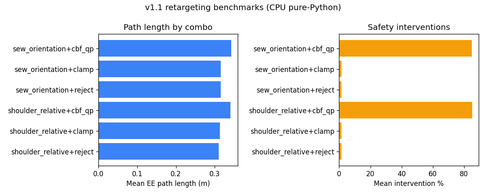

# Results — Retargeting v1.1

**Host:** `scholar-fe04.rcac.purdue.edu` (Purdue Scholar frontend)  
**Python:** 3.9.21 · **OS:** Linux 5.14 el9 x86_64  
**Date (UTC):** 2026-07-28  
**Command:**

```bash
python3 benchmarks/benchmark_retargeting_v11.py \
  --config benchmarks/config/v11.yaml \
  --output results/v1.1
```

Evidence: [`results/v1.1/`](../../results/v1.1/) · Protocol: [`experiment-protocol.md`](experiment-protocol.md)

## Aggregate comparison (measured on this host only)

| Combination | Map mean (ms) | Safety mean (ms) | Mean EE path (m) | Interventions | Solver fails | Dropped cmds | Interv. % |
|---|---:|---:|---:|---:|---:|---:|---:|
| shoulder_relative + reject | 0.033 | 0.003 | 0.310 | 11 | 0 | 26 | 1.4 |
| shoulder_relative + clamp | 0.032 | 0.003 | 0.313 | 11 | 0 | 15 | 1.4 |
| shoulder_relative + cbf_qp | 0.039 | 0.360 | 0.341 | 681 | 0 | 15 | 85.1 |
| sew_orientation + reject | 0.218 | 0.004 | 0.315 | 11 | 0 | 26 | 1.4 |
| sew_orientation + clamp | 0.215 | 0.004 | 0.315 | 11 | 0 | 15 | 1.4 |
| sew_orientation + cbf_qp | 0.234 | 0.369 | 0.342 | 679 | 0 | 15 | 84.9 |

## Observations (honest)

1. **SEW-inspired retargeting is ~6–7× slower** than shoulder-relative on this host (~0.22 ms vs ~0.033 ms) but still sub-millisecond — not a real-time bottleneck at 20 Hz.
2. **CBF-QP intervenes frequently** (~85% of steps) because velocity limits and barriers reshape almost every command; this is expected for a tight experimental filter, not proof of physical collision avoidance.
3. **Solver failures: 0** after active-set QP hardening (failure still rejects, never pass-through).
4. **Path lengths** are similar across retargeters under reject/clamp; CBF-QP lengthens paths slightly while reshaping motion.
5. **No physical Franka metrics** and **no joint-level SEW-Mimic accuracy**.

## Plots



## Baseline CPU mapping (pre-v1.1, same host class)

| Metric | Value |
|--------|------:|
| Mapping latency mean (ms) | 0.0054 |
| Pipeline stage mean (ms) | 0.0191 |

See [`baseline-state.md`](baseline-state.md).
