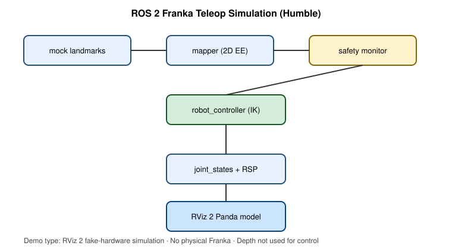

# ROS 2 Simulation Documentation

See also:

- [`scholar/ROS2_SIMULATION.md`](../scholar/ROS2_SIMULATION.md)
- [`docs/ros2-readiness-report.md`](ros2-readiness-report.md)
- [`results/ros2/`](../results/ros2/)

## What is demonstrated

A ROS 2 Humble teleoperation pipeline driving a **Franka Emika Panda** model in **RViz 2** using simulated joint states.

**Demo type:** RViz 2 fake-hardware simulation on Purdue Scholar  
**Input:** Smooth mock human-landmark trajectory  
**Mapping:** Shoulder-relative end-effector position teleoperation  
**Depth:** Not used for control  
**Hardware:** No physical Franka connected  
**Gazebo:** Not the verified recording backend

## Architecture



```text
mock landmarks
    -> human_to_robot_mapper
    -> safety_monitor
    -> robot_controller
    -> /joint_states
    -> robot_state_publisher
    -> RViz 2 Panda
```

## Verified evidence

The original Scholar run verified:

- Both ROS 2 packages built with `colcon`.
- Target poses, accepted command poses, safety status, and joint states were published near 20 Hz.
- Joint-state travel was nonzero and `joints_moved` was true.
- RViz 2 was recorded through Xvfb.
- GIF, MP4, and thumbnail outputs were generated from the actual run.

The repository does not claim physical Franka movement or Gazebo execution.

## Reproduction

```bash
# 1) Build the container once
sbatch scholar/build_ros2_container.slurm

# 2) Build the workspace and verify topics and joints
sbatch scholar/run_ros2_simulation.slurm

# 3) Record and compress the RViz 2 demo
sbatch scholar/record_ros2_demo.slurm
```

## Safety behavior

The current branch includes:

- `allow_real_robot: false`
- Workspace clamping
- Cartesian command-rate limiting
- Message timestamp staleness rejection
- Pose-loss watchdog cancellation
- Emergency-stop cancellation
- Explicit cancellation release after recovery
- Hold-at-current-joints trajectory on cancel
- Panda joint-limit validation before trajectory publication

These are portfolio and simulation safeguards. They are not certified safety software and do not replace Franka Desk configuration, FCI reflexes, a physical E-stop, collision testing, or an authorized laboratory procedure.

## Post-demo hardening boundary

The committed video was captured before the latest watchdog, cancellation-release, hold, and joint-limit hardening changes. GitHub pure tests and lint pass for the hardening changes, but the full Scholar simulation should be rerun before merging if updated runtime evidence is required.

```bash
sbatch scholar/run_ros2_simulation.slurm
sbatch scholar/record_ros2_demo.slurm
```

Do not replace the existing evidence files unless both jobs actually complete successfully.

## Known limitations

- Geometric IK is a demonstration approximation, not industrial-grade Franka IK.
- The verified Scholar recording path uses simulated joint states for reliability under Xvfb.
- A full Gazebo Panda world is not bundled or claimed.
- Depth remains visualization-only and does not affect the command target.
- Physical Franka tracking accuracy and end-to-end hardware latency are not measured.
